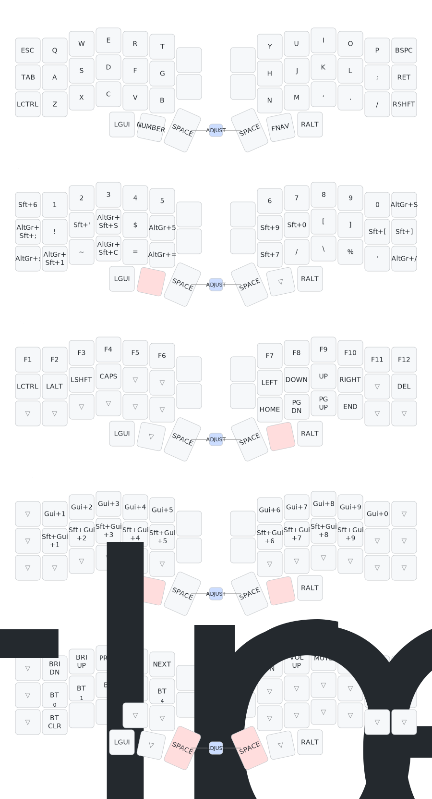

# Corne Choc Pro Keymap

Personal ZMK firmware config for the **Corne Choc Pro** — a 42-key wireless split keyboard with low-profile Choc switches, OLED displays on both halves, and `nice_view` screens. Tuned for software development on **Fedora + GNOME + Forge tiling** with US-QWERTY base layout and German character input via the Linux `us altgr-intl` layout.



The image above is regenerated automatically on every push by the [`draw-keymap`](.github/workflows/draw-keymap.yml) workflow using [keymap-drawer](https://github.com/caksoylar/keymap-drawer).

## Layer reference

| # | Layer    | Activation                       | Purpose                                                       |
|---|----------|----------------------------------|---------------------------------------------------------------|
| 0 | QWERTY   | default (always active)          | US-QWERTY alphas with programmer-friendly punctuation on base |
| 1 | NUMBER   | hold left-thumb **Lower**        | Digits `1`–`0`, brackets, math/programming symbols, `€`, `ß`  |
| 2 | FNAV     | hold right-thumb **Raise**       | F1–F12, arrow cluster, Home/End/PgUp/PgDn, modifiers, Del     |
| 3 | TILING   | hold **Lower + Raise** together  | GNOME workspace switching + window-to-workspace movement      |
| 4 | ADJUST   | tap-combo **Left Space + Right Space** | Media keys, brightness, Bluetooth profile select, system reset |

### Tiling layer details (GNOME + Forge)

| Row     | Left half                           | Right half                          |
|---------|-------------------------------------|-------------------------------------|
| Top     | `Q W E R T` → `Super+1..5` (switch workspace) | `Y U I O P` → `Super+6..0`          |
| Middle  | `A S D F G` → `Shift+Super+1..5` (move window to workspace) | `H J K L` → `Shift+Super+6..9`      |
| Bottom  | unused (use base + Super for `Super+HJKL` focus) | unused (use base + Shift+Super for move) |

Window focus (`Super+HJKL`) and window movement (`Shift+Super+HJKL`) are not duplicated on the tiling layer because the base layer already exposes `H/J/K/L` directly — just hold the Super thumb (and Shift if moving).

## German character input

The base layer is plain US-QWERTY with no German keys. Umlauts and `ß` are produced via the Linux **`us altgr-intl`** keyboard layout, which makes the right Alt key (`AltGr`) a dead-key modifier:

| Char | Combo          | Char | Combo              |
|------|----------------|------|--------------------|
| `ä`  | `AltGr + Q`    | `Ä`  | `AltGr + Shift + Q`|
| `ö`  | `AltGr + P`    | `Ö`  | `AltGr + Shift + P`|
| `ü`  | `AltGr + Y`    | `Ü`  | `AltGr + Shift + Y`|
| `ß`  | `AltGr + S`    | `€`  | `AltGr + 5`        |

Set the layout once with:

```sh
setxkbmap -layout us -variant altgr-intl    # X11
# or in GNOME: Settings → Keyboard → Input Sources → "English (intl., with AltGr dead keys)"
```

The right thumb on the base layer is mapped to `RALT`, which acts as `AltGr` under this layout — so umlauts are reachable without leaving the home row.

## Bluetooth profiles

The board supports up to 5 paired Bluetooth hosts. Profile selection lives on the **ADJUST layer** (Left Space + Right Space combo):

| Key (ADJUST layer position) | Action                          |
|-----------------------------|---------------------------------|
| `Q` (`BT 0`)                | Switch to BT profile 0          |
| `W` (`BT 1`)                | Switch to BT profile 1          |
| `E` (`BT 2`)                | Switch to BT profile 2          |
| `R` (`BT 3`)                | Switch to BT profile 3          |
| `T` (`BT 4`)                | Switch to BT profile 4          |
| `A` (`BTCLR`)               | Clear bond on the active profile (re-pair to switch host) |
| `S`                         | `sys_reset` — soft reboot the controller |
| `D`                         | `bootloader` — enter UF2 bootloader for flashing |

To re-pair a host: select the profile slot, run `BTCLR` to drop the existing bond, then re-pair from the host's Bluetooth settings.

## Building and flashing

Firmware builds run automatically on every push via the [`build`](.github/workflows/build.yml) workflow. Download the `.uf2` artifacts from the Actions run and flash by:

1. Power off the half being flashed.
2. Connect via USB-C and double-press the controller's reset button — a `KEEBART` (or `NICENANO`) drive should mount.
3. Copy the matching `nice_view-corne_choc_pro_{left,right}-zmk.uf2` to the drive. The board reboots automatically when the copy completes.
4. Repeat for the other half.

Use the `settings_reset-*-zmk.uf2` images only if you need to wipe persistent settings (e.g. corrupted BT bonds).
